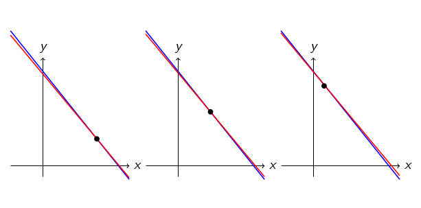
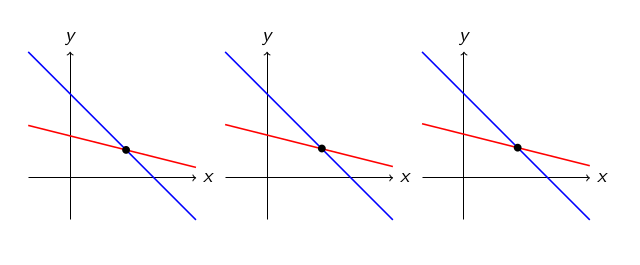
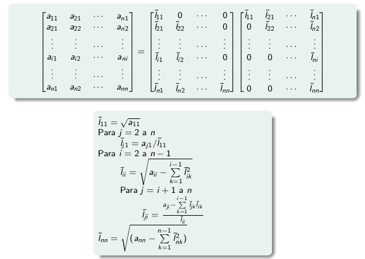

# Preguntas por tema

## Aritmetica finita

- Aritmética finita. Que cosas debería tener en cuenta? O errores que puedo tener.

  Que no es representable toda la recta, entonces se pueden dar errores de
  presición por redondeo.

- Que es el epsilon de la maquina?

  Es el nombre que se le da al maximo error relativo que puede cometerse
  con redondeo.

- Aritmética finita: errores por culpa de aproximar, distribución, errores clásicos.

  Los numeros reales están distribuidos de forma exponencial en la recta
  numérica, hay mas de los más chicos y a medida que te vas a los extremos la
  distancia es mayor.

- Problemas de aritmetica finita

  - Restar numeros similares (cancelación catastrófica)
  - Multiplicar por numeros grandes o dividir por numeros chicos
  - Sumar numeros de distinta magnitud (los grandes siempre ganan)

- Qué cuidados tengo que tener al trabajar con aritmética finita.
- si yo quiero trabajar con aritmetica finita, cuales son los problemas clasicos
  con los que me puedo enfrentar?

- 3ra v2021
  - Como le preguntamos eficientemente a la computadora si un 0 es efectivamente
    un 0? (|val| < eps)

    Viendo que el valor en módulo sea menor al epsilon de máquina.

  - Que problemas podemos tener con aritmetica finita?

    - Restar numeros similares (cancelación catastrófica)
    - Multiplicar por numeros grandes o dividir por numeros chicos
    - Sumar numeros de distinta magnitud (los grandes siempre ganan)

  - Que metodo vimos que podria sufrir cancelacion catastrofica?

    LU con las sumas y restas de filas. Una forma de solucionarlo es hacer LU
    con pivoteo.

## EG / LU

- Toda matriz tiene LU? De que depende?

  No toda matriz tiene LU, ya que se hace EG que tiene que tener un valor
  diferente de 0 siempre en la diagonal.

- Conoces alguna condición si y sólo si para que tenga LU (aparte de la de eliminación Gaussiana)

  A tiene todas sus submatrices principales no singulares sii tiene fact. LU.

  Es una buena prop teórica (se usa para demostrar edd => existe LU) pero es
  costosa de chequear.

- Unicidad de LU

  Si A tiene fact LU y es inversible, entonces la fact. LU es unica.

  La demo era por el absurdo, suponiendo que no era y multiplicando por las
  inversas (ya que A es inversible, L y U tambien lo son) quedaba que tenian que
  ser una diagonal (en realidad que son iguales).

- Existencia de LU

  LU existe para edd, submatrices principales no singualres y SDP.

  - sdp
  - demo submat: por induccion en las submatrices, en el paso inductivo se hace
    como el despeje de LU
  - edd
    - Primero se demuestra el lema A edd => A inversible
    - Y luego basta con
      A edd
      - => todas las submat principales son edd (porque la diagonal es la misma)
      - => todas las submat principales son no singulares (por lema)
      - => existe fact. LU (por la otra prop)

- Por que no podria hacer eliminacion gausseana (la que es sin pivoteo)?

  Porque en cada paso de EG la diagonal tiene que ser distinta de 0, porque se
  usa ese coeficiente para dividir y al restar que quede 0 en esa fila.

- Que hago si en un paso no puedo hacer la eliminacion gausseana?

  Depende, si hay todos 0s, se saltea y listo. Sino, se busca alguno que no sea
  0 y se permutan las filas (porque permutar deja un sistema equivalente). En
  cuanto a LU, eso resulta en una factorizacion PLU,

  $$PA = LU$$

- Que problema tengo si hago eliminacion gausseana con pivoteo para conseguir LU? (No es LU de A)

  Es LU de PA en vez de A

- por qué queremos pivotear en EG aunque no tengamos necesidad

  Para evitar problemas por aritmetica finita, como dividir por numeros chicos o
  restar numeros muy similares / sumar numeros de distinta magnitud.

- Pregunto si LU siempre existía. Bajo qué condicion podes asegurar que una matriz cualquiera tiene LU

  LU no siempre exxiste. Se puede asegurar para edd y submat principales no
  singulares.

- 3ra v2021
  - Que tiene de dieferente la LU de una SDP? Por que calculamos la LU? Que pasa
    cuando encuentra un 0?

    La LU de una SDP siempre existe y tiene la particularidad de que se puede
    expresar como un producto de una matriz triangular inferior con su
    traspuesta, llamada factorizacion de cholesky (surge de la simetria,
    haciendo cuentitas parecidas a la demo de unicidad de LU para no singulares)

  - Que sabemos sobre los sitemas de ecuaciones? (Cuando tienen sol)

    Un sistema de ecuaciones Ax = b va a tener solución siempre y cuando b esté
    en la imagen de la transformación lineal A.

    Si lo está, puede tener solución única (si las columnas de A son LI) o
    infinitas (si son LD).

  - Cuando podemos hacer EG? Que obtenemos de yapa?

    Cuando no se anulan los coeficientes de la diagonal durante el proceso. De
    yapa obtenemos la factorización LU.

## Normas y numero de condicion

- Qué es el número de condición? Intuición y definición.
- Qué es el número de condición.
- qué es el número de condición y cómo se calcula
- Que es el numero de condicion de una matriz? Que interpretacion geometrica
  hicimos en clase? (3ra v2021)

El número de condición es ||A|| * ||A^-1|| para alguna norma inducida. Brinda
una forma (a traves de la formula de error) de determinar si pequeños cambios en
el vector independiente implican pequeños cambios en el vector solucion.

En un sistema *mal condicionado* (con numero de condicion grande) pequeños
cambios en el vector independiente involucran grandes cambios en el vector
solucion. En R^2, esto se puede interpretar gráficamente como que las dos
ecuaciones están muy juntas, entonces al moverlas un poco cambia mucho la
solución.



En cambio, un sistema bien condicionado se podría ver en R^2 como rectas más
cerca de ser perpendiculares, entonces girarlas un poco no cambia casi nada la
solución.



## SDP

- Qué puedo usar para resolver un sistema si la matriz es sdp.

  La factorización de cholesky.

  A = LLt

  Luego

  Ax = b

  LLtx = b

  tomo Ltx = y

  - Ly = b: resuelvo un sistema ti en O(n^2) y obtengo $y$
  - Ltx = y: resuelvo otro sistema ti en O(n^2) y obtengo x, la solucion al
    sistema original.

- Si una matriz es simétrica definida positiva (s.d.p.) cómo te conviene
  resolver un sistema lineal?

  Con la fact. de cholesky

- Unicidad de cholesky

  Para matrices sdp, la factorización LU siempre existe, y podemos derivar de
  ella la de cholesky, que por lo tanto también siempre existe.

  Y esta es única, porque al plantear el producto LLt, cada coeficiente de L
  queda unívocamente determinado a partir de A.

  

- por qué podés preferir LU a Cholesky porque preferir cholesky a LU

  Cholesky sobre LU porque puede llegar a ahorrar espacio, ya que si uno tiene
  una matriz triangular inferior ocupa n/2 de espacio almacenarla mientras que
  LU ocupa siempre n (n/2 + n/2). En cambio cholesky es n/2.

  LU sobre cholesky porque cholesky no siempre existe, solo para matrices SDP.

- Que tiene de especial la factorizacion LU en una SDP

  Que se puede expresar como la factorizacion de cholesky, que es LLt y ocupa
  menos espacio.

- 3ra v2021
  - Cholesky, explicar para que sirve
  - Que podes decir de la LU de una SDP? (u diagonal positiva)

## QR

- Toda matriz tiene factorización QR? Es unica? Bajo condiciones lo es?

  Toda matriz tiene factorización QR porque los métodos de Givens y Householder
  se pueden aplicar a cualqueir matriz. Si la matriz es inversible, es única si
  requerimos que la diagonal de R sea positiva (y siempre se puede llevar a que
  la diagonal de R sea positiva multiplicando por una diagonal ortogonal que
  tenga los signos de R)

- Que es QR

  QR es una factorización de A = QR donde Q es ortogonal y R triangular
  superior.

- Existencia de QR

  QR existe siempre

- Unicidad de QR
- Metodos para resolver QR

  - Givens: Rotaciones
  - Householder: Reflexiones

- la factorizacion qr siempre existe? es única? Nombrar metodos para encontrar
  la factorizacion qr de una matriz. Solo nombrarlos, no explicarlos

- Nombrar un metodo de construccion. Siempre hay QR? Para que lo podemos usar en
  la materia? (3ra fecha verano 2021, mati)

  QR se puede usar para resolver sistemas de ecuaciones lineales y también para
  resolver CML.

## Autovalores

- Hay algun caso donde A tenga base de autovectores seguro?
- Dar alguna condición para afirmar que tenemos una base de autovectores.

  Base de autovectores es que los autovectores de la matriz forman una base.
  Esto no siempre pasa.

  Dos:

  - A diagonalizable por semejanza sii base (pero no es facil de chequear)
  - A simetrica (y ademas la base de autovectores es **ortonormal**)

- Metodo de la potencia, que condiciones tiene para aplicarse?
- Qué condiciones deben valer para método de la potencia.
- Qué condiciones son necesarias para que el método de la potencia converja?
- Condiciones del método de la potencia
- Algún método para encontrar el autovalor más grande de una matriz.
- Cómo puedo encontrar el radio espectral.
- Qué es el radio espectral?

  El radio espectral es el autovalor mas grande en modulo de una matriz. Para
  encontrarlo se puede usar el **metodo de la potencia**. Este tiene como
  condiciones
  - Para aplicarse que los autovectores conformen una base
  - Hay un autovalor dominante en modulo

  Define una sucesión que converge a este autovalor.

- Si yo tengo que encontrar el segundo autovalor dominante como hago?

  Aplicando el *método de deflación* si el segundo autovalor es tambien
  dominante en modulo. Este involucra multiplicar a A por
  matrices de householder, de esa forma dejando el primer autovalor

  La matriz B que queda abajo hereda los autovalores restantes, y tiene uno
  dominante. Por lo tanto se puede seguir aplicando el metodo de la potencia.

  Si voy encontrando una listita de autovalores dominantes puedo seguir
  aplicando ambos metodos.

- Cuantos autovalores tiene una matriz
- Como son los autovalores de una matriz? (mencionar la multiplicidad)

  Una matriz tiene n autovalores contando la multiplicidad, porque son las
  raices del poly caracteristicos, que tiene grado n.

  Av = lv
  Av - lv = 0
  (A - lI)v = 0. Como v no es 0, A - lI es singular cuando l es un autovalor
  asociado al autovector v

  Entonces det(A - lI) = 0 = P(l) (poly caracteristico) para los autovalores.

- Para cada autovalor hay un autovector, entonces tengo n autovectores?

- 3ra v2021
  - Que es una matriz semejante? Toda matriz es semejante a una diagonal?

    A y B son semejantes si existe P inversible tal que A = P^-1BP. Si lo son,
    tienen los mismos autovalores.

    Una matriz es diagonalizable por semejanza si es semejante a una diagonal.
    No todas lo son porque sino todas tendrian base de autovalores.

## SVD

- Qué son los valores singulares?

  Los valores singulares son la raiz de los autovalores de la matriz AtA o AAt
  (tienen los mismos).

- SVD, no me acuerdo qué pero explicación en general
- Que es SVD
- Como sabes que se pueden conseguir los autovalores de SVD

- 3ra v2021
  - Que es la factorizacion SVD?

    Es una factorizacion

    UΣVt, en donde

    - U, V son ortogonales. Las col de U son los autovectores de AAt y las de V
      de AtA.
    - Σ es una diagonal con los primeros r valores singulares (raices de los
      r (rango) autovalores no nulos de AtA)

  - Por que puedo asegurar que tengo base de autovectores?

    Porque AtA y AAt son simetricas.

  - Explicar por que los valores singulares son positivos (AtA y AAt semi DP)

    Como B = AtA es semi DP, xtBx > 0 para x != 0

    entonces Bv = lv sii vtBv = vtlv = l vtv = l ||v||_2^2 >= 0

    Como v != 0, la norma es mayor estricta que 0, entonces l >= 0. Y los
    valores singulares son las raices de los autovalores no nulos, entonces son
    positivos.

## Iterativos

- Qué tiene que pasar para la convergencia de métodos iterativos.

  Los metodos iterativos tienen el siguiente esquema

  $x^{k+1} = Tx^k + c$

  Los metodos que vimos son dos, Jacobi y Gauss Seidel. Se diferencian en cual
  es la matriz que gobierna la iteracion y el vector independiente.

  La convergencia esta dada por propiedades segun T. Converge para cualquier
  $x_0$ inicial sii el radio espectral de T es menor estricto que 1. $\rho(T) <
  1$

- Matrices edd, q características tienen? Tienen alguna relacion con los métodos iterativos vistos?

  Las matrices edd (estrictamente diagonal dominantes) son aquellas para las
  cuales el valor de la diagonal en modulo es mayor estricto a la suma del resto
  de la fila (tambien en modulo).

  Cuando la matriz A (la del sistema) es edd, converge Jacobi y Gauss-Seidel.

- Cuándo convergen los metodos iterativos? Condiciones necesarias y suficientes.

  Condiciones suficientes
  - edd => jacobi y gs convergen
  - sdp => gs converge

  Condiciones necesarias y suficientes
  - $\rho(T) < 1$ con T la de la iteracion.

- Que es un metodo exacto? (Cant finita de pasos llega al resultado)

  Un metodo exacto es uno que en una cantidad de pasos finita llega al resultado
  final, mientras que uno iterativo genera una sucesion que converge a la
  solucion del sistema.  

- Características de algún método iterativo que te sirva si A es sdp

  Gauss-Seidel. Es una sofisticacion de Jacobi en la que va usando todas las
  coordenadas que va obteniendo en vez de definirlas todas segun el paso
  anterior.

- Definición de convergencia

  Un metodo iterativo converge si la sucesion que genera converge a la solucion
  del sistema (lo cual no siempre pasa)

- 3ra v2021
  - Cual es la diferencia principal entre EG y los metodos iterativos? (eg
    numero finito de pasos, iterativos no)

    EG es un metodo exacto y un iterativo genera una sucesion que eventualmente
    converge.

  - Que tiene que cumplir la T del esquema de iterativos para converger? Que
    podemos decir de A para que lo cumplan?

    P(T) < 1

    edd => jacobi y gs cvg

    sdp => gs cvg

## CML

- Interpretación geométrica cml

  La solucion de cuadrados minimos es el x tal que minimice $||Ax - b||_2^2$

  Si b esta en la imagen de A, entonces es el x que resuelve el sistema y listo,
  pues es minimo cuando Ax = b (pues la norma 2 seria 0).

  Si b no esta en la imagen de A, hay que buscar el valor en la imagen de A que
  mas cerca este de b. El que lo minimiza es la proyeccion ortogonal sobre la
  imagen, que es b1 (con b = b1 + b2, b1 en Im(A) y b2 en Nu(At), que siempre se
  puede expresar porque estan en suma directa)

- Tengo un problema de cuadrados mínimos, siempre tiene solucion?
- Existencia de la solucion en cuadrados mínimos lineales
- Existencia y unicidad de cuadrados mínimos
- Unicidad de solucion en cml

  Si, pues b1 esta en la imagen de A. Sera unica si las columnas de A son LI,
  sino hay infinitas.

- Que métodos conoces para resolver cuadrados mínimos?
- Métodos para resolver cuadrados mínimos lineales
- por qué resolverías un sistema de cml con SVD en vez de QR, ventajas y desventajas

  - Ecuaciones normales
  - QR
  - SVD

- Cuadrados Mínimos: Interpolar vs Aproximar, Criterios para aproximar, CML, solución de CML, unicidad, métodos
- Qué son los cuadrados mínimos.

  Interpolar es pasar exactamente por los datos, mientras que aproximar es pasar
  "cerca". Hay varias formas de formalizar que es cerca,

  - Tomar la funcion que minimice el maximo error: sufre de problemas con los
    outliers
  - Tomar la func que minimice la suma de los errores: esta buena pero usa
    modulo que no es diferenciable, entonces es mas dificil de minimizar.
  - Cuadrados minimos: la funcion que minimice la suma de los cuadrados de los
    errores, es derivable y tiene en cuenta todos los errores.

- Que metodo conoces para aproximar

  CML

- Que es el problema de CML (sin hablar de la matriz Ax = b)

  Dada una tabla de valores x_i y y_i buscamos f tal que mejor aproxime a los
  datos, que minimice la suma de los errores al cuadrado.

  Para encontrar f, define F una familia de funciones LI y f sera una
  combinacion lineal de ellas. Solucionar CML entonces es encontrar los
  coeficientes de la CL.

- Como se lleva el problema de CML a Ax=b

  Ax = b, donde

  - A = las funciones evaluadas

  ```text
  A = f_1(x_1) ... f_n(x_1)
            .
            .
            .
      f_1(x_n) ... f_n(x_n)
  ```

  x = (c_1, ..., c_n) los coef de la CL
  b = (y_1, ..., y_n) los y-es

  El problema de cuadrados minimos lineales entonces es encontrar el x que
  minimice

  $\min_{x\in \mathbb{R}^n} ||Ax - b||_2^2$

- Qué puedo usar para resolver cuadrados mínimos.
- Como se puede resolver CML

  La solucion de CML entonces es el x tal que Ax = b1, donde b1 es la componente
  de b que esta en la imagen de A.

  Esto es un problema porque no conocemos b1, entonces hay otras formas de
  resolverlo:
  
  - eq normales: AtAx = Atb, numericamente inestable.
  - qr
  - svd

- si quisiera resolver cuadrados minimos utilizando las ecuaciones normales, que me dirias? me lo recomendarias o no? por que?

  Tiene de bueno que es un sistema cuadrado re lindo y facil de hacer, pero es
  muy inestable numericamente. Si es importante la presicion y la estabilidad, no te lo recomendaria.

- Qué criterios vimos para aproximar? (cuadrados mínimos) ¿A qué nos referimos con lineales (en cuadrados mínimos)?

  Lineales porque es una combinacion lineal de las funciones de la familia (que
  no necesariamente son lineales).

- 3ra fecha verano 2021
  - Por que decimos que CML es lineal? Por que esta bueno en comparacion a no
    lineales? Tiene sol unica? Por que?

    CML es lineal porque es una combinacion lineal de funciones (no
    necesariamente lineales). Esta bueno porque sabemos resolverlo, sistemas no
    lineales no sabemos.

    La solucion es el x tq Ax = b1, con b = b1 + b1 (b1 in Im(A) y b2 in
    Nu(At)). Es unica si A tiene sus columnas LI.

  - Cual es la diferencia entre interpolar y aproximar?

    Aproximar es parecerse a los datos de la mejor forma posible, mientras que
    interpolar es pasar por ellos si o si.

  - Cuales son los metodos que vimos para aproximar un conjunto de valores?

    CML

  - Siempre tiene sol CML? Como puedo resolverlo? (nombrar opciones)

    Siempre tiene solucion porque es el x tq Ax = b1 y b1 esta en la imagen de
    A. Se puede resolver con

    - Ecuaciones normales: AtAx = Atb. Son un sistema cuadrado y lindo pero son
      inestables numericamente.
    - QR: Usa el algoritmo de factorizacion QR
    - SVD

## Interpolacion

- Quiero dar un polinomio interpolador. Siempre existe? Que algoritmos conoces para calcularlo?

  Si, siempre existe.

  Algoritmos:

  - Lnk: tiene la desventaja que es costoso agregar un nuevo dato
  - Diferencias divididas
  - Qij

- Interpolación: existencia, unicidad, problemas cuando el polinomio es de grado muy grande, Interpolación fragmentaria. Objetivo de tener derivadas primera y segunda.
- El polinomio interpolante trae problemas en N's altos, que otra forma conoces?

  Interpolacion fragmentaria o splines. Interpolar en fragmentos

- Que condiciones se le pide a la interpolacion cubica?

  - Que sea interpolante (2n cond)
  - Que este bien definida la primera y segunda derivada (n-1 cond)
  - Sobran condiciones! Condiciones de frontera (n-1 cond)

- Siempre existe la interpolacion cubica con esas condiciones exigidas?

  Si, porque el sistema resultante es edd

- para qué sirve interpolar

  Para predecir valores que no nos dieron

- Diferencia entre interpolar y aproximar
- Cuándo usaría cuadrados mínimos o interpolación.

  Si hay outliers, no usaria interpolacion

- Aplicaciones de polinomio interpolante.

  Hacer interpolacion

- Diferencia entre polinomio interpolador y splines.

  Los splines usan poly interpoladores en segmentos

- Si siempre puedo usar splines y por qué.

  Si, porque siempre existen y son unicos.

- diferencia entre interpolar polin de lagrange y spline
- qué es un spline, por qué existe, y las condiciones que deben darse
- Condiciones que se le piden a splines cúbicos
- Existencia de splines, está siempre asegurada?

  si

- Orden de convergencia de la rta q diste en la pregunta anterior
- Que problema tiene la expresion del polinomio de lagrange?

  agregar valores

- Unicidad del polinomio interpolante, es unico?

  si, porque sino interpola a si mismo y por error son iguales

- Quiero resolver un sistema con splines, cubicos, ponele que con frontera sujeta. Siempre tengo solución? Por qué?

  si, y es unica. Porque el sistema resultante de las condiciones es edd

  y edd => no singular => existe sol y es unica.

- Por que los splines cubicos siempre existen?

  Porque el sistema de las condiciones es edd.

- Definicion, formula del error, existencia y unicidad. Problema principal
  (oscila). Splines cubicos, tiene unica sol? Por que? (3ra fecha verano 2021,
  mati)

## Integracion

- si quisiera integrar una funcion en un intervalo, como me recomendarias que lo haga?

  Todas las formas que vimos se basan en *cuadratura numerica*, que es un
  esquema en donde la integral se aproxima mediante una combinacion de valores
  de la funcion en un conjunto de datos.

  - Regla de trapecios: Toma un poly interpolante de grado 1 entre el primer y
    ultimo punto del intervalo y su area es la aproximacion
  - Regla de simpson: Toma un poly interpolante de grado 2 entre el primer,
    ultimo y uno del medio.
  - Compuestas

    Se dividen los intervalos, se aplica alguna regla en ellos y luego la
    integral resultante es la suma. Estilo sumas de riemann. Se puede hacer con
    trapecios y simpson.

  - Adaptativas: Son reglas compuestas que no parten el intervalo de forma
    uniforme, sino que lo van partiendo segun la granularidad que sea necesaria.

## Ceros de funciones

- Si te doy una funcion de la q no sabes prácticamente nada, que usas para obtener el 0 de la función?
- Quiero encontrar ceros de funciones, y no se nada de mi funcion, decime que necesitarias y recomendame algo?

  Bisección porque siempre se puede usar y siempre converge, aunque es un poco
  lento.

- decime los métodos para calcular ceros de una función y cuándo éstos sirven
- Ceros: biseccion, newton, secante, regla falsa.

  - Biseccion: siempre. Usa teorema de bolzano (signo diferente entre dos
    puntos, raiz en el medio)
  - Newton: Usa teorema del punto fijo y garantiza un orden de cvg de 2. Pero
    usa la derivada primera que tal vez no se sabe
  - Secante: Como newton pero en vez de recta tangente, recta secante entre dos
    puntos
  - Regla falsa: Como biseccion pero en vez de tomar el punto del medio, hace
    una recta secante y se queda con el punto en el que es 0.

- Estas feliz con biseccion? (orden malo, mencionar newton)

  No, orden malo de convergencia. Es lento

- cuándo converge Newton
- Condiciones para la convergencia de newton
- Método de Newton, qué condiciones necesito para converger.

  Newton converge cuando el valor inicial está suficientemente cerca de la raíz.

- dar la explicacion geometrica de newton
- Cuál es la idea intuitiva del método de newton?

  Hace rectas tangentes a la función en cada punto, y sigue por donde la
  tangente se anula.

- Diferencia entre Newton y método de la secante.
- Comparar Newton con secante

  Secante evita la necesidad de saber la derivada primera porque usa una recta
  secante en vez de tangente.

- Método de newton, alguna crítica.

  Es necesario saber la derivada primera. Esto puede no ser facil o ser costoso.

- Método de biseccion. Alguna crítica.

  Orden de convergencia lento

- Orden de convergencia del método de la secante

  Superlineal

- Qué condición requiere una funcion para que funcione biseccion

  Encontrar dos puntos que tengan signo diferente

- Explicame como funciona secante

  Es como newton pero usa rectas secantes en vez de tangentes. Requiere dos
  puntos para empezar, y luego toma el siguiente viendo donde se anula la recta
  secante que pasa por f(x0) y f(x1), y asi sigue.

- Que problema puede tener secante

  No converger

- 3ra fecha v2021
  - Caracteristicas de cada metodo
  - Explicar orden de convergencia
  - Relacion entre Newton y teorema del punto fijo.

    Newton usa el teo del punto fijo para definir un algoritmo que define una g
    particular, para garantizar cierto orden de convergencia.

  - Con que criterio se toma la g de newton? (para garantizar cvg orden 2)

    La g de newton es x - f(x)/f'(x). Se toma asi para garantizar orden de
    convergencia 2 (que se anulen las dos primeras derivadas, por teo de punto
    fijo.)

## General

- De que sirve que una matriz sea EDD para algo de la materia?

  Para LU y que GS, jacobi converjan
