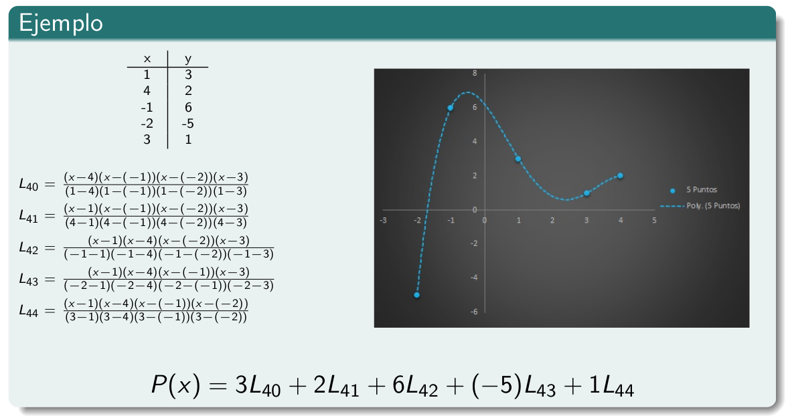

<!-- markdownlint-disable MD045 -->
<!-- MD045/no-alt-text: Images should have alternate text (alt text) -->
# Resumen temas teoricos

Resumen de temas que no entraron en los parciales

## Interpolación

Dado un conjunto de pares ordenados de valores $(x_i, y_i)$ ($x_i$ variable
independiente y $y_i$ la variable dependiente) para $i = 0, ..., n$, buscamos
una funcion $f(x)$ que **interpole** a los datos,

$$f(x_i) = y_i \quad \forall i= 0,\dots,n$$

> Con cuadrados minimos, **aproximabamos** al conjunto de datos. Esto en
> terminos matematicos lo traducimos de varias maneras. La interpolacion exige
> que sea igual, y esa es la diferencia sustancial entre aproximacion e
> interpolacion.

Nosotros nos restringimos a trabajar con polinomios, buscar un poly que
interpole a los datos. Preguntas que vamos a hacernos:

- **Existe?** Si
- **Es unico?** Si

Definimos $L_{nk} = \prod_{i = 0, i\neq k}^{n}\frac{x - x_i}{x_k - x_i}$ donde n es el grado y k es el que voy a omitir

Donde,

- $L_{nk}(x)$ es el poly de grado n
- $L_{nk}(x_i) = 0 \quad \forall i = 0,\dots\,n \quad i \neq k$
- $L_{nk}(x_k) = 1$

Y $P(x) = \sum_{k=0}^{n} y_k L_{nk}(x)$ el poly de grado $\leq n$

- $P(x_i) = y_i \forall i=0,\dots,n$
- $P(x)$ es el polinomio interpolante

Ejemplo:

### Error

> Nosotros de analisis conocemos el poly de taylor, que tiene una funcion que lo
> relaciona con la original. Aca va a haber algo parecido.

Si tenemos una funcion derivable hasta n+1, continua

> Demo:
>
> - Para un punto que es de la muestra, es cierta pues se anula el producto de
>   la derecha.
> - Para puntos que no son de la muestra, isa define una funcion magica.
>
>   El $\xi$ es el punto en donde se anula la derivada $g^{n+1}$, que es en
>   funcion de los puntos.

Esta permite demostrar la unicidad.

### Unicidad

Dados $(x_i, y_i)$, para $i = 0,\dots,n$ el poly interpolante de grado $\leq 0$
es unico.

> **Demostración**
>
> Sean $P_1$ y $P_2$ poly interpolantes. A $P_2$ lo puedo considerar como poly
> interpolante de $P_1$. Usando la formula del error,
>
> $$ P_1(x) = P_2(x) + \frac{P_1^{n+1}(\xi(\bar{x}))}{(n+1)!}(\bar{x} - x_0)\dots(\bar{x} - x_n)$$
> Y como la derivada
> de orden n+1 de un poly de grado n se anula, y asi tengo
>
> $$ P_1(x) = P_2(x)$$

### Diferencias divididas

> **Motivacion**: Si nos agregan un dato, tenemos que recalcular todas las
productorias y armar el poly de cero. Pero hay varias maneras de expresar un
poly, hay otra que haga que este proceso sea mas conveniente?

**Def** (Diferencias divididas): Dados $(x_i, f(x_i))$ para $i = 0,\dots,n$

- Orden 0: $f[x_i] = f(x_i)$
- Orden 1: $f[x_i, x_{i+1}] = \frac{f[x_{i+1}] - f[x_i]}{x_{i+1} - x_i}$
- Orden $k$: $f[x_i, x_{i+1},\dots,x_{i+k}] = \frac{f[x_i, x_{i+1},\dots,x_{i+k}] - f[x_i, x_{i+1},\dots,x_{i+k-1}]}{x_{i+k} - x_i}$

Luego el poly interpolante se puede escribir como

> Demostracion:
> Por induccion,
>
> - CB: $n = 1$. Ver que es interpolante (viendo que interpola los puntos,
>   entonces como es unico tiene que ser el interpolante.)
> - PI: $n-1 \implies n$

Esto es util porque para agregar un nuevo elemento a la tabla basta con agregar
una suma mas a la expresion.

$$P_{n+1}(x) = P_n(x) + f[x_0\dots x_{n+1}](x-x_0)\dots(x-x_n)$$

Se suele calcular de forma ordenada con una piramide (estilo PD)

### Qij

Esto se usa para una nueva definicion, los $Q_{ij}$. Para hacer un esquema muy
parecido al de las diferencias divididas para extender los polinomios

| gr 3                             | gr 4                             |
| -------------------------------- | -------------------------------- |
|  |  |

### Variando el grado

A medida que se agreguen datos se incrementa el grado del polinomio. Y viendo la
grafica, a mayor grado mas oscilaciones, que pasa siempre que aumenta el grado.
Esto no esta bueno, a mas puntos, mas informacion, pero mas oscilaciones no son
buenas para interpolar porque incrementan el error.

Queremos poder decir cuanto vale una aproximacion de la funcion en un punto que
no estaba en nuestra tabla de valores. Si varia demasiado, la aproximacion a un
valor fuera de la tabla no seria tan buena.

Queremos tener un compromiso entre agregar mas puntos y tener un grado alto

### Interpolaciones segmentarias

Para evitar eso, consideramos sub intervalos en vez de todos los puntos a la
vez. Estos se llaman tambien **splines**

- **Interpolacion lineal segmentaria**

    En lugar de considerar todos los puntos a la vez, considera sub intervalos.
    Interpola de a par de valores (con rectas (poly de grado 1)).

    

    

    La funcion resultante es continua pero **no derivable**, que es la critica
    mas grande que se le hace al metodo (porque en los puntos puede haber un
    quiebre y la derivada no estaria definida). No puede construir funciones
    *suaves*

- **Interpolacion cuadratica segmentaria**

    Ahora entre dos pares consecutivos consideramos una cuadratica en vez de una
    lineal.

    Como falta una condicion, se pueden definir de maneras diferentes.

    
    

- **Interpolacion cubica segmentaria**

    Considera poly de grado 3 en cada intervalo. Hay 4 coef a determinar.

    Les pedimos que

  - Sean interpolantes
  - Este bien definida la primera derivada (de el mismo valor de cada lado)
  - Segundas derivadas bien divididas (n-1 cond nuevas)

  Hasta aca tenemos 4n-2 condiciones, y nos faltan 2 para llegar a nuestras 4n
  variables. Dos alternativas de *condiciones de frontera*

  1. Que la derivada segunda no se anule en el primer punto y en el ultimo
  2. Que la derivada en el primero y ultimo punto tome el mismo valor que la
     funcion a interpolar

  Es posible satisfacer todo esto? Si, siempre existe y es unico!

  > Dem: Uno llega a un sistema edd en funcion de los $c_i$ (se pueden expresar
  > el resto de las incognitas en funcion de las $c_i$), entonces sabemos
  > que existe solucion y es unica. (esta en el material complementario)

  - Da curvas suaves
  - Es derivable (buenas propiedades)

  
  

  > **Error comun de final**: Pedir algo no quiere decir que se vaya a cumplir,
  > se cumple porque el sistema es edd.

## Integración

Nos enfocamos en los metodos de **cuadratura numerica**, que es un esquema
generan en donde la integral se aproxima mediante una combinacion de valores de
la funcion en un conjunto de datos.

$$\int_a^b f(x)\ dx \approx \sum_{i=0}^n f(x_i)$$

Por ejemplo, mediante el poly interpolante

Los $a_i$ son las integrales de los $L_{ni}(x)$, y el error que cometemos es la
integral de la formula del error

### Un intervalo

Los metodos varian en cual es el grado del poly interpolante

- **Grado 1: Regla de trapecios**

  

  Formula que surge de considerar el poly de grado 1, donde los puntos
  considerados son los extremos del intervalo.

  > Se puede demostrar eso del error, pero isa no entra en detalles.

  Si a la funcion le podemos encontrar una cota de la derivada segunda en el
  intervalo $[a, b]$, podemos acotar el error cometido al calcular la integral
  de esta manera.

  

  Otra forma de ver la formula de la integral es el area del trapecio

- **Grado 2: Regla de Simpson**

  Puntos: extremo, y ademas uno extra (del medio)

  

  $x_0, x_2$ extremos, y $x_1$ del medio.

  

  

  El area determinada por la curva del interpolante es la aproximacion.

### Compuestas

Hasta ahora esto era en un solo intervalo. Pero usando esta idea, se puede
dividr a un intervalo en intervalos mas pequeños, y en cada uno aplicar
trapecios o simpson. Estas son las reglas **compuestas**, la integral la
aproximamos por la suma de todas las aproximaciones. Ahora entonces la integral
es la suma de los intervalos.

Es basicamente sumas de riemann

- **Reglas compuestas: Trapecios**
  
  

  El error es la suma de errores de los intervalitos (no entra en detalles para
  ver de donde viene, se puede ver de la bib.)

  

- **Reglas compuestas: Simpson**

  En cada intervalito hay 3 puntos

  k

  

### Reglas adaptativas

La idea parece muy apropiada, y sugiere que a mayor cantidad de intervalos mejor
va a ser la integral. Pero esto es a costa de un costo mayor, porque requiere
mas evaluaciones de la funcion.

Si hacemos simpson en una funcion, por ej.

Observamos que del lado izquierdo alcanza con la subdivision que tenemos, sin
embargo del lado derecho la particion da una aprox buena pero no lo suficiente.
Convendria tener un intervalo mas chico. Agregamos solo mas en esas zonas

De esta manera obtenemos una mejor aproximacion. En este caso, hay que tener
algun tipo de regla **adaptativa** que diga que del lado izquierdo no hace falta
que divida mas, pero no del lado derecho.

Y como se haria eso para simpson? El algoritmo seria algo asi como partir en 2
con simpson, y seguir aplicando en cada mitad recursivamente, cortando cuando el
error en el intervalo es parecido al de la suma de los errores de los intervalos
partidos.

Al principio se define un $\epsilon$, y en cada particion se divide por dos. Si
es menor al epsilon, no hace falta seguir. Si es mayor, partimos en dos
devuelta y asi.

De esta forma se va *adaptando* la cantidad de particiones.

## Ceros de funciones

Nuestro objetivo es dada una funcion $f: \mathbb{R} \to \mathbb{R}$ buscar $x^*$
tq $f(x^*) = 0$ (raiz de la funcion).

> Dependiendo de la funcion, esto puede ser sencillo o complicado

### Esquema general

Se genera una sucesion que bajo ciertas condiciones converge, y el limite es una
raiz de la funcion. Sucesion $\{x_k\}_0^\infty$ tal que bajo ciertas
condiciones,

$$\lim_{k\to\infty}{x_k = x^*} \text{ con } f(x^*) = 0$$

Los metodos varian segun como la generan y las condiciones de convergencia

### Criterios de comparacion

- Costo computacional
- Condiciones de convergencia (que props debe cumplir f)
- **Orden de convergencia**

  Tiene que ver con la velocidad con la cual la suc se
  acerca al limite. Hay varias maneras de definirla, una es a traves de un
  limite que relaciona el error de los pasos.

  

  Si el limite existe, mientras mayor sea P, mayor sera la velocidad en la cual
  converge. P=1 lineal, P=2 cuadratica.

  Otra manera es comparando la sucesion que tenemos con una que tienda a 0. Si
  logramos que el error del k-esimo sea menor que la que tiende a 0 ($\beta_k$), podremos
  decir que converge al menos tan rapido como la otra.

  Por ejemplo,

  

### Metodo de bisección

Se basa en el teorema de Bolzano, que nos dice que si tenemos una funcion
continua en un intervalo que tiene signos diferentes en el los extremos, seguro
hay un 0. Usando esto, se puede definir un proceso recursivo para encontrar el

Tomo un punto en el medio. Si es 0, listo. Sino, con algun extremo tiene
diferente signo y continuo por ese intervalo de la mitad de tamaño.

Ejemplo:

| Paso                        | Desc                                    |
| --------------------------- | --------------------------------------- |
|  | Difiere el signo en el primer intervalo |
|  | Continuo buscando por ese               |

Considerando la sucesion que tiene los puntos del medio, podemos demostrar que
converge a una raiz. Sea $f$ continua en $[a, b]$ tq $f(a)f(b) < 0$ (diferente
signo). La sucesión $\{c_k\}_0^\infty$ definida por el algoritmo de bisección
siempre converge a una raíz de f.

Orden de convergencia? Por el metodo 1, tiene orden de convergencia de $p = 1$,
al menos lineal.

El algoritmo tiene un fin, y puede tener distintos criterios de parada:

- Cantidad de iteraciones
- Que entre dos iteradas sucesivas el error (absoluto o relativo) sea menor a un
  $\epsilon$.
- Que el valor de la funcion sea menor a un $\epsilon$
- Que la medida del intervalo sea menor a $\epsilon$.

Ninguno de estos criterios es certero.

Ventajas y desventajas del metodo:

- \+ Es barato, no pide muchas condiciones. Los requerimientos es solamente que sea continua y que difiera el signo.
- \+ Siempre converge
- \+ Puedo ver el error y definir un criterio de parada
- \- Es muy lento.

### Punto fijo

A veces cuando tengo un problema, puedo querer transformarlo en otro para
resolverlo, y que ambos sean equivalentes (si tengo sol para uno sera para el
otro). El problema de ceros de funciones esta relacionado con el de **punto
fijo**.

**Def** (punto fijo):

La interseccion de la recta y = x con la funcion nos da los puntos fijos.

Se puede establecer una relacion entre los puntos fijos de una funcion y los
ceros de otra. Sean $g(x): \mathbb{R} \to \mathbb{R}$ y $f(x) = g(x) - x$.

$$ x^* \text{ es punto fijo de g sii } x^* \text{ es raiz de } f.$$

Asi como para raices o ceros tenemos el Teo de Bolzano que nos da condiciones
suficientes, para existencia de punto fijo tenemos el siguiente teorema

Ejemplo:

#### Algoritmo de Punto Fijo

Y por la primer formula del error, como $M < 1$, si hacemos el limite en el
infinito $x_k \xrightarrow{k\to\infty} x^*$. Entonces la sucesion converge a un
punto fijo.

Condiciones que tiene que cumplir la función:

- Que vaya de $[a, b]$ en si mismo
- Su derivada este acotada por una constante menor que 1.

Graficamente, hay una espiral al rededor del punto fijo.

- Convergencia alternante: En una iterada al a izquierda, en la otra a la
  derecha y asi.

  

- Convergencia monotona: Una sucesion monotona creciente

  

- Divergencia

  

Orden de convergencia:

El orden de convergencia coincide con el orden de la primera derivada que no se
anula en el punto fijo.

> Dem: Con poly de taylor

### Newton

Hay mas de una manera de relacionar punto fijo con ceros, no solamente definir
$g(x) = f(x) + x$.

> Por ejemplo, si la func al que le queremos encontrar el poly es
> $f(x) = 4x^3 - 10x^2 + 5x - 17$
> Podria definir todas estas, y coinciden los puntos fijos con los ceros
>
> - $g_1(x) = \frac{17}{4x^2 - 10x + 5}$
> - $g_2(x) = \frac{-4x^3 + 10x^2 + 17}{5}$
> - $g_3(x) = \frac{4x^3 + 5x -17}{10x}$

Como el orden de convergencia depende de la cantidad de derivadas que se anulan
en el punto fijo, convendria tomar una en la que se anulen mas. Buscamos una
metodologia general que convenga para cualquier funcion.

Para eso, sean $f(x)$ y $x^*$ una raiz. Definimos $g(x) = x - h(x)f(x)$ donde
$h(x^*) \neq 0$ (No es raiz tambien de h, porque sino no existe la relacion
entre los puntos fijos de g y los ceros de f). Entonces $x^*$ es punto fijo de
$g$ sii $x^*$ es raiz de f. Si aplicamos el algoritmo de punto fijo a g, buscamos
que tenga convergencia cuadratica

- $g'(x^*) = 0 = 1 - h'(x^*)f(x^*) - h(x^*)f'(x^*)$

  Como $f(x^*) - 0$,

  $0 = 1- h(x^*)f'(x^*) \implies h(x^*) = \frac{1}{f'(x^*)}$

  El problema es que h tiene que cumplir condiciones en funcion de $x^*$, el
  cual no conozco.

  Y una candidata es $h(x) = \frac{1}{f'(x)}$, y entonces $g(x) = x -
  \frac{f(x)}{f'(x)}$

El **Algoritmo de Newton** entonces no es mas que reemplazar la candidata a g en
el algoritmo general de punto fijo $x_{k+1} = g(x_k)$

$$x_{k+1} = x_k - \frac{f(x_k)}{f'(x_k)}$$

Pero todo esto es *en el caso de que converga* tengamos orden cuadratico. Y que
condiciones debe cumplir la f para que converga?

El punto inicial a partir del cual inicio el algoritmo no puede ser cualquiera.
Tiene que ser *suficientemente cercano* a la raiz para que converga. Esto es lo
que queda abierto en el algoritmo de Newton.

#### Interpretacion geometrica

Parece que toma el poly de taylor de orden 1, y toma donde se anula como
aproximacion de la funcion. El lugar en el cual se anula la recta tangente. La
recta tangente es una buena aproximacion a la funcion cuando estoy
suficientemente cerca de la raiz.

#### Casos particulares

Hay casos particulares en los que converge, las funciones crecientes y convexas.
La raiz es unica y converge sin importar de donde se arranque.

### Algoritmo de la secante

La critica principal de Newton es que requiere conocer la derivada primera de la
funcion, lo cual puede llegar a ser costoso de calcular. Como alternativa, es el
**algoritmo de secante**. En lugar de considerar un punto toma dos, y considera
la recta secante en vez de la tangente. El lugar en donde se anula es el proximo
punto.

Un problema es que no necesariamente converge (condiciones en la bibliografia).
Pero una propiedad que tiene es que perdemos la convergencia cuadratica que daba
newton, sino que tiene una **superlineal** (mayor que 1 pero menor que 2). (Es
razonable porque dejamos de pedir la derivada, entonces lo teniamos que pagar en
algun lado)

### Algoritmo de la regla falsa

Conjuga biseccion con secante. En vez de tomar el punto del medio como con
biseccion, considera la recta secante y toma el punto en el que se anula.

- Parte de dos puntos donde la funcion difiere en signo. En lugar de tomar el
  punto intermedio, considera el punto donde la recta secante que pasa por ambos
  se anula. Eso determina un tercer punto
- Se aplica la misma regla que en biseccion para decidir con que intervalo
  continuar el proceso, y asi.

La ventaja que tiene de la secante es que entre dos iteradas sucesivas podemos
afirmar que se encuentra ahi la raiz (por las propiedades buenas que tenia
biseccion).

