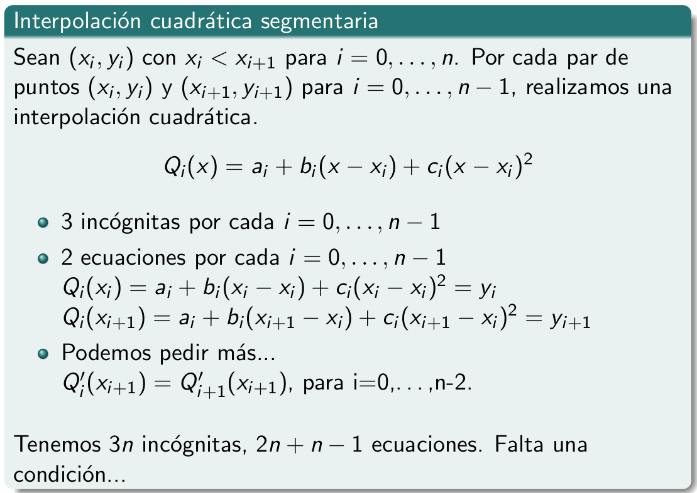

<!-- markdownlint-disable MD045 -->
<!-- MD045/no-alt-text: Images should have alternate text (alt text) -->
# Resumen temas teoricos

Resumen de temas que no entraron en los parciales

## Interpolación

Dado un conjunto de pares ordenados de valores $(x_i, y_i)$ ($x_i$ variable
independiente y $y_i$ la variable dependiente) para $i = 0, ..., n$, buscamos
una funcion $f(x)$ que **interpole** a los datos,

$$f(x_i) = y_i \quad \forall i= 0,\dots,n$$

> Con cuadrados minimos, **aproximabamos** al conjunto de datos. Esto en
> terminos matematicos lo traducimos de varias maneras. La interpolacion exige
> que sea igual, y esa es la diferencia sustancial entre aproximacion e
> interpolacion.

Nosotros nos restringimos a trabajar con polinomios, buscar un poly que
interpole a los datos. Preguntas que vamos a hacernos:

- **Existe?** Si
- **Es unico?** Si

Definimos $L_{nk} = \prod_{i = 0, i\neq k}^{n}\frac{x - x_i}{x_k - x_i}$ donde n es el grado y k es el que voy a omitir

Donde,

- $L_{nk}(x)$ es el poly de grado n
- $L_{nk}(x_i) = 0 \quad \forall i = 0,\dots\,n \quad i \neq k$
- $L_{nk}(x_k) = 1$

Y $P(x) = \sum_{k=0}^{n} y_k L_{nk}(x)$ el poly de grado $\leq n$

- $P(x_i) = y_i \forall i=0,\dots,n$
- $P(x)$ es el polinomio interpolante

Ejemplo:

### Error

> Nosotros de analisis conocemos el poly de taylor, que tiene una funcion que lo
> relaciona con la original. Aca va a haber algo parecido.

Si tenemos una funcion derivable hasta n+1, continua

> Demo:
>
> - Para un punto que es de la muestra, es cierta pues se anula el producto de
>   la derecha.
> - Para puntos que no son de la muestra, isa define una funcion magica.
>
>   El $\xi$ es el punto en donde se anula la derivada $g^{n+1}$, que es en
>   funcion de los puntos.

Esta permite demostrar la unicidad.

### Unicidad

Dados $(x_i, y_i)$, para $i = 0,\dots,n$ el poly interpolante de grado $\leq 0$
es unico.

> **Demostración**
>
> Sean $P_1$ y $P_2$ poly interpolantes. A $P_2$ lo puedo considerar como poly
> interpolante de $P_1$. Usando la formula del error,
>
> $$ P_1(x) = P_2(x) + \frac{P_1^{n+1}(\xi(\bar{x}))}{(n+1)!}(\bar{x} - x_0)\dots(\bar{x} - x_n)$$
> Y como la derivada
> de orden n+1 de un poly de grado n se anula, y asi tengo
>
> $$ P_1(x) = P_2(x)$$

### Diferencias divididas

> **Motivacion**: Si nos agregan un dato, tenemos que recalcular todas las
productorias y armar el poly de cero. Pero hay varias maneras de expresar un
poly, hay otra que haga que este proceso sea mas conveniente?

**Def** (Diferencias divididas): Dados $(x_i, f(x_i))$ para $i = 0,\dots,n$

- Orden 0: $f[x_i] = f(x_i)$
- Orden 1: $f[x_i, x_{i+1}] = \frac{f[x_{i+1}] - f[x_i]}{x_{i+1} - x_i}$
- Orden $k$: $f[x_i, x_{i+1},\dots,x_{i+k}] = \frac{f[x_i, x_{i+1},\dots,x_{i+k}] - f[x_i, x_{i+1},\dots,x_{i+k-1}]}{x_{i+k} - x_i}$

Luego el poly interpolante se puede escribir como

> Demostracion:
> Por induccion,
>
> - CB: $n = 1$. Ver que es interpolante (viendo que interpola los puntos,
>   entonces como es unico tiene que ser el interpolante.)
> - PI: $n-1 \implies n$

Esto es util porque para agregar un nuevo elemento a la tabla basta con agregar
una suma mas a la expresion.

$$P_{n+1}(x) = P_n(x) + f[x_0\dots x_{n+1}](x-x_0)\dots(x-x_n)$$

Se suele calcular de forma ordenada con una piramide (estilo PD)

### Qij

Esto se usa para una nueva definicion, los $Q_{ij}$. Para hacer un esquema muy
parecido al de las diferencias divididas para extender los polinomios

| gr 3                             | gr 4                             |
| -------------------------------- | -------------------------------- |
|  |  |

### Variando el grado

A medida que se agreguen datos se incrementa el grado del polinomio. Y viendo la
grafica, a mayor grado mas oscilaciones, que pasa siempre que aumenta el grado.
Esto no esta bueno, a mas puntos, mas informacion, pero mas oscilaciones no son
buenas para interpolar porque incrementan el error.

Queremos poder decir cuanto vale una aproximacion de la funcion en un punto que
no estaba en nuestra tabla de valores. Si varia demasiado, la aproximacion a un
valor fuera de la tabla no seria tan buena.

Queremos tener un compromiso entre agregar mas puntos y tener un grado alto

### Interpolaciones segmentarias

Para evitar eso, consideramos sub intervalos en vez de todos los puntos a la
vez. Estos se llaman tambien **splines**

- **Interpolacion lineal segmentaria**

    En lugar de considerar todos los puntos a la vez, considera sub intervalos.
    Interpola de a par de valores (con rectas (poly de grado 1)).

    

    

    La funcion resultante es continua pero **no derivable**, que es la critica
    mas grande que se le hace al metodo (porque en los puntos puede haber un
    quiebre y la derivada no estaria definida). No puede construir funciones
    *suaves*

- **Interpolacion cuadratica segmentaria**

    Ahora entre dos pares consecutivos consideramos una cuadratica en vez de una
    lineal.

    Como falta una condicion, se pueden definir de maneras diferentes.

    
    

- **Interpolacion cubica segmentaria**

    Considera poly de grado 3 en cada intervalo. Hay 4 coef a determinar.

    Les pedimos que

  - Sean interpolantes
  - Este bien definida la primera derivada (de el mismo valor de cada lado)
  - Segundas derivadas bien divididas (n-1 cond nuevas)

  Hasta aca tenemos 4n-2 condiciones, y nos faltan 2 para llegar a nuestras 4n
  variables. Dos alternativas de *condiciones de frontera*

  1. Que la derivada segunda no se anule en el primer punto y en el ultimo
  2. Que la derivada en el primero y ultimo punto tome el mismo valor que la
     funcion a interpolar

  Es posible satisfacer todo esto? Si, siempre existe y es unico!

  > Dem: Uno llega a un sistema edd en funcion de los $c_i$ (se pueden expresar
  > el resto de las incognitas en funcion de las $c_i$), entonces sabemos
  > que existe solucion y es unica. (esta en el material complementario)

  - Da curvas suaves
  - Es derivable (buenas propiedades)

  
  
